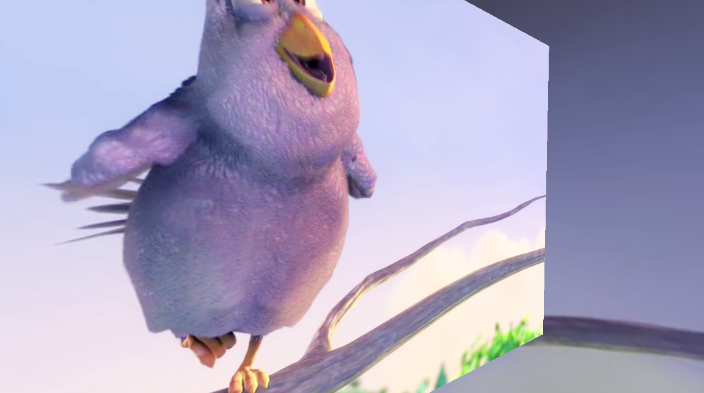
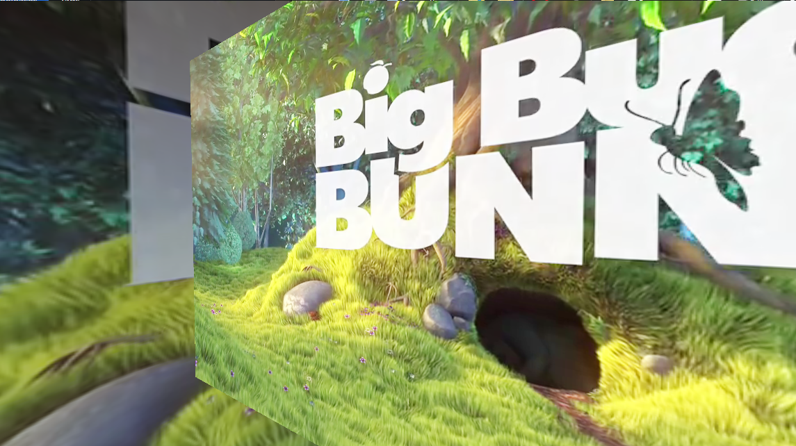

# gd-videoplayer

A GDExtension for godot 4.x to play video, this is a wrapper of ffmpeg for decode

Some showcase in below

||||
|-|-|-|
 
### Getting started:

In order to setup the project\
Check this page for build process

#### 1. Open build/windows_pull_submodule.bat
- This will clone the godot-cpp 4.1 in the root folder.
- And it will download the ffmpeg 6.0 windows build from github and unzip in the src folder.
- In the end your file structure will looks like below.

- root
	- build
	- src
		- src
		- ffmpeg (Add if desktop)
	- godot-cpp (Add)
	
#### 2. Open build/windows_codegen.bat.

- This will generate the solution in the `GDExtensionTemplate-build` folder.

#### 3. Open GDExtensionTemplate-build/GDExtensionTemplate.sln.

- You cannot just build the solution for some reason, I can't find a way to change Runtime library from /MDd to /MD.
- So first, open property of GDExtensionTemplate project.
- Change C/C++ -> Code Generation -> Runtime Library from /MDd to /MD.
	- If you don't change this options you will getting bunch of link error.
- After build is finish and success, the output will be in the `GDExtensionTemplate-build\GDExtensionTemplate` folder.

### Repository structure:
- `build/` - All the build scripts in here.
- `src/` - Source code of this extension.
	- `ffmpeg/` - FFmpeg library.
	- `src/` - Wrapper source code.
- `godot-cpp/` - Submodule needed for GDExtension compilation.

### known issues

- When play HLS stream, audio will not be load
- Sometime in editor mode, the audio stream player will failed to initialize (Engine issue ?)

### Supported platfrom
| Platform | Video | Audio | XR Support |
|-|-|-|-|
| Windows | O | O | X |
| MacOS | X | X | X |
| Linux | X | X | X |
| Android | X | X | X |
| IOS | X | X | X |
| Web File | X | X | X |
