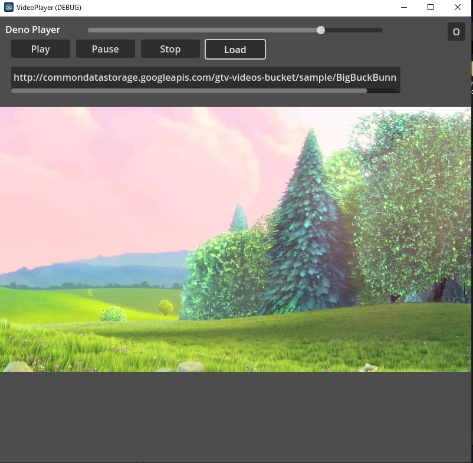
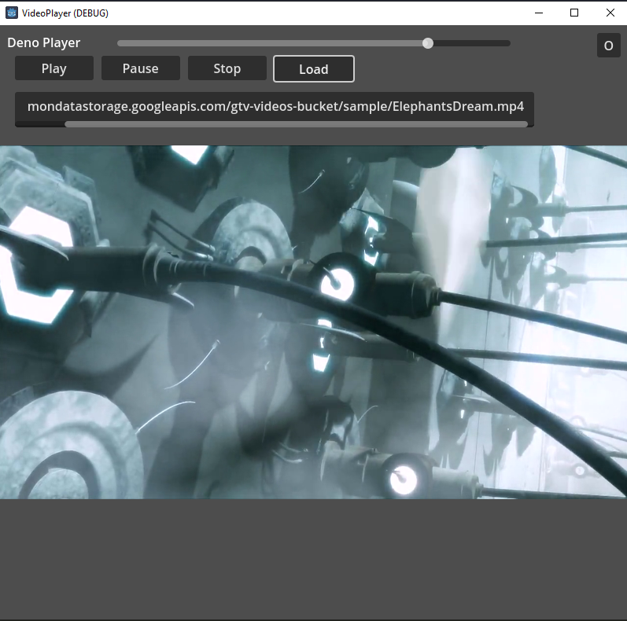
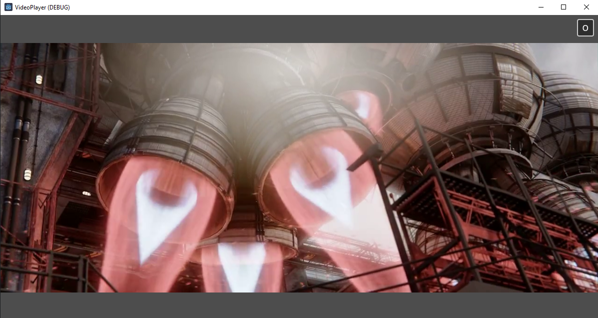

# elly-videoplayer

A general video player for godot 4.x, unity, unreal to play video, this is a wrapper of ffmpeg for decode

Below example use godot engine import gdextension for video player

||||
|-|-|-|

The above demo use URL are all in the example project player file [link](https://github.com/Elly2018/gd_videoplayer/blob/main/example/Script/DemoMediaPlayer.gd)\
And apply to VR sphere mesh and a viewport texture in front of player

### Repository structure:
- `build/` - All the build scripts in here.
	- `Godot/` - the godot project build scripts
	- `Unity/` - the unity project build scripts
	- `Unreal/` - the unreal engine project build scripts
- `src/` - Source code of this extension.
	- `ffmpeg/` - FFmpeg library.
	- `src/` - Wrapper source code.
- `mobile/` - Mobile source code projects for Android, IOS
- `example/` - The video player implementation
	- `Godot/` - the godot video player project
	- `Unity/` - the unity video player project
	- `Unreal/` - the unreal engine video player project
	
### Dependencise structure:
- `godot-cpp/` - Submodule needed for GDExtension compilation.

### known issues

- HLS will stuck at buffering sometimes
- hardware acceleration not include

### Supported platfrom
| Platform | Video | Audio | XR Support |
|-|-|-|-|
| Windows | O | O | △ |
| MacOS | X | X | X |
| Linux | O | O | △ |
| Android | X | X | X |
| IOS | X | X | X |
| Web File | X | X | X |
